---
---
# RF Capture & Demodulation

I'd never done any work with RF before, so my first step was to spend some time on Google getting my bearings.  While there was was no documentation on the particular devices I wanted to interface with, there is a smattering of documentation and tutorials on getting started with RF in general.

### Tools
After some browsing I decided on the following tools:

- [RTL-SDR](http://www.rtl-sdr.com/) - I stumbled upon the site and bought a cheap dongle.
- [gnuradio & gnuradio-companion](http://gnuradio.org/) - Invaluable for capturing and cleaning up the wireless signal, though also occasionally infuriating for a beginner.
- [inspectrum](https://github.com/miek/inspectrum) - A helpful tool for visualizing the recorded signal to identify its characteristics
- python - I haven't used python much, but since gnuradio-companion generates python scripts, I decided to use python for all my code.

It's also worth adding that Michael Ossmann's [SDR Lessons](http://greatscottgadgets.com/sdr/) were invaluable in quickly picking up the basics for someone who had no experience in RF.  I found the lesson on filters especially useful.

### Identifying the signal

#### Trip to the FCC
I started with a trip to the FCC website.  In what turned out to be a consistent refrain, I could have accomplished it faster, but I only discovered a tool after I was already done: [fcc.io](http://fcc.io/).  In any case, FCC documentation yielded the operating frequency of the sensors as 344.94 Mhz.  This doesn't seem to be a very popular frequency, so I'm not sure why Honeywell chose it --- perhaps specifically for its obscurity?

The device itself is a pretty straight forward two-part switch.
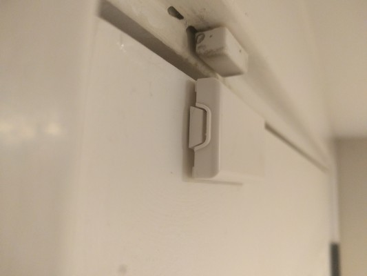
The smaller top part is just a magnet. The bottom contains the electronics and includes a reed switch to sense when the door or window is open, via the presence or absence of the neraby magnet.  I removed one from the wall; its case is built to allow removal so that the battery can be replaced.

The internals looks like this:
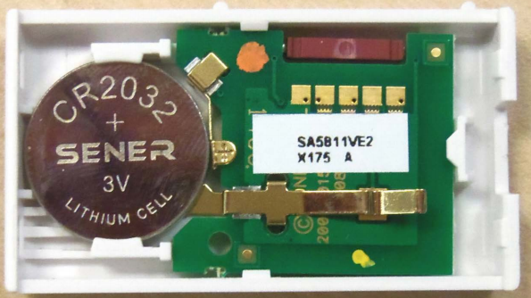
The reed switch the red/brown device at the top.  The metal arm on the bottom is a tamper sensor.  If the case is opened the sensor breaks contact with the PCB.  For fear of breaking it, I didn't try to take the PCB out to see what's on the other side.  If you're curious though, the [FCC filing](http://fcc.io/CFS8DL58112) does have internal photos of the reverse as well.

The other thing that was useful from the FCC filing was the width of the signal I should expect:
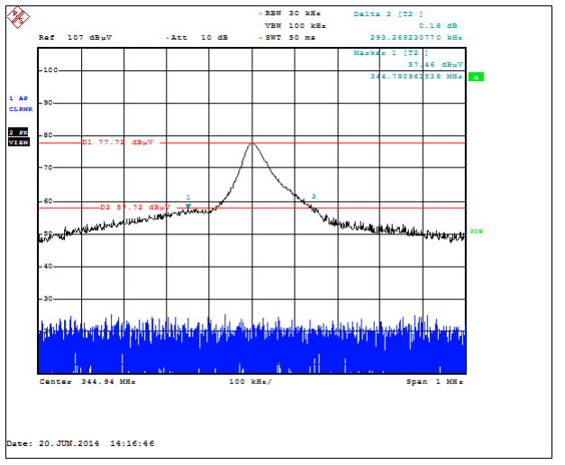
Based on the filing, it looked to me like the signal spanned 100 kHz to either side of the 344.94 MHz center.  I ended up filtering slightly more narrowly based on the real world signal.

#### Seeing the signal in real life
To confirm the information in the FCC filing, and to test whether I could correctly use the SDR hardware and GRC software, I removed one of the switch sensor pieces from its door, and used a permanent magnet as a manual trigger.  With an FFT sink running, it was clear that both moving the magnet to the sensor (i.e. "door close") and removing the magnet again (i.e. "door open") triggered the sensor to transmit a signal at ~345 MHz, as expected.  And it did appear to be about 100 KHz wide, as per the FCC filing.  Here's a screenshot of the FFT with max hold on, after a close and open trigger:
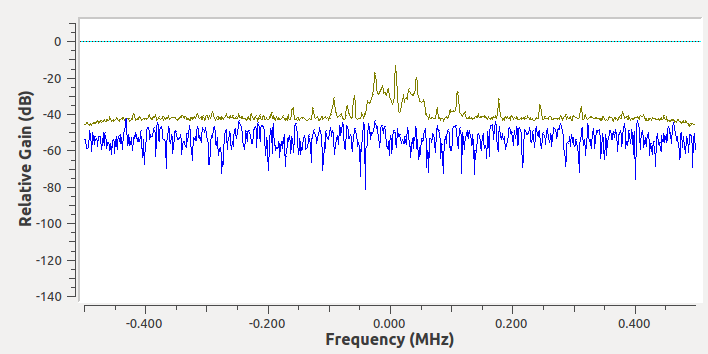

I did end up adding a pretty narrow lowpass filter later to clean up the other noise around the signal.  I haven't extensively tested how performance various with different filter settings.  Here's the FFT viewing the same signal, but after the filter has been applied:
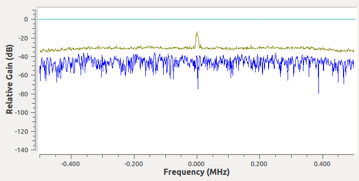

In addition to confirmation of the signal's frequency, one other observation I was able to make from the FFT was that was that the signal appeared to repeat twice for each trigger of the sensor, with a gap in between the repeat.  (Later in the process, I learned that each of those repeated signals was actually itself six repeats of the same message, for a total of 12 per message trigger).

Around this time I also noticed that the distance between the sensor and the antenna greatly impacted the visibility of the signal.  If I tried triggering a sensor across the house with max hold on, there was almost no signal at all.  Once again demonstrating how much of a novice I truely am in rf, the solution was incredibly simple, but unfortunately a hour of two out of sight.  Eventually I tried changing the "Ch0 Gain Mode" in the osmocom source in GRC from Manual to Automatic, and like magic, signals further than a couple feet became visible.

### Decoding the signal

#### Visualizing the signal
I assumed there was some sort of bitstream being transmitted in each pulse I was seeing in the FFT, so next I tried using a time sink to visualize the bitstream.  This proved to be very difficult, in part because of the nature of the Honeywell sensor, but more because of my unfamiliarity with GRC.  For the sensor's part, it was difficult to trigger it at a precise moment.  Moving the magnet near and away from the reed switch did trigger it, but getting it to trigger at the exact moment I was pausing the sink proved almost impossible.  I literally was able only to capture it one time, and even then I missed the beginning of the signal.

The good news, which I discovered as I was nearing completion of this project, is that it's actually quite easy to capture signals using triggers in GRC.  So please learn from my wasted time: use a time sink, run it, and use the center mouse button (or both left and right simultaneously) to show the context menu.  From there, show the control panel, and change the Trigger mode to "Auto" and "Negative", and then increase the trigger level until it is well above your background noise, but within the range of your signal level (this might take some trial and error).  Once you trigger the transmission even on the device (and the amplitude of the signal therefore reaches your trigger level), the display will pause, leaving you with the signal frozen in time.

For my signal, had I figured out how to use triggers at that time,I would have found a signal that looks like:
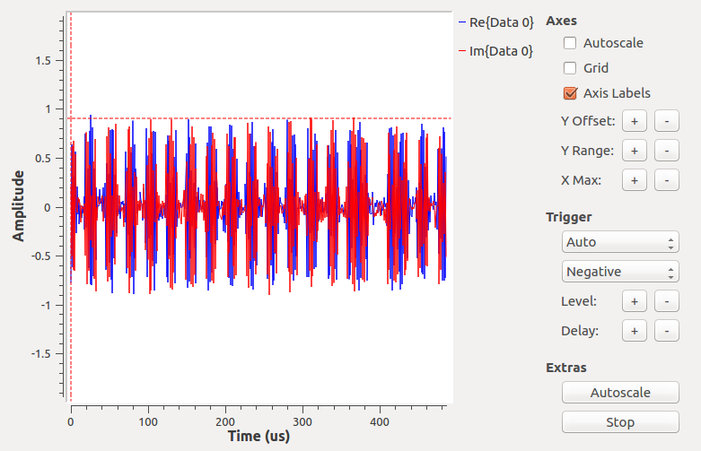
In reality, all I saw was a blur of signal moving past the screen, but I was able to tell enough to see that there appeared to be short and long pulses, and the amplitude of the signal carried the information: it was either large or zero over time.  I got a better look by recording the signals to disk and opening the result in inspectrum.  Changing the FFT width gives you a chance to see the signal over a long length of time (wide FFT) or lose signal width but see high time resolution (narrow FFT).  My recorded signals looks like this:

| wide FFT | Narrow FFT |
|--------|--------|
|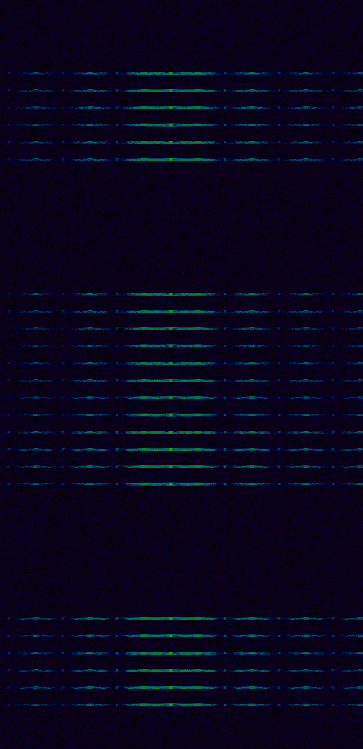|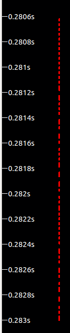|

On the left you'll see 24 lines.  Each of these is a single transmission from the sensor.  In particular, this is a "close" followed by an "open".  Though you wouldn't know it from this view, the first twelve lines are identical signals (with a gap in time after the first six) and the next twelve are also identical (again with a time gap before the lsat six).
The narrow FFT, on the right, is much more useful for seeing the form of the signal itself.  The entire right screenshot is the same as a single one of the horizontal lines on the left.  The time dimension is just much more stretched out.  From this view, it's clear that the sensor's transmission is comprised of short and long pulses.

#### Failed attempts at decoding the signal
From here, I naively though I was close to being able to decode the signal and move on to analyzing the protocol.  Unfortunately, I spent hours down the rabbit hole of trying to get gnuradio to demodulate the signal for me.  Examples on the internet showed use of various combinations of the AM Demod, Clock Recovery MM, Binary Slicer, and other blocks.  Unfortunately, the specifics of all of these are not especially well documented, especially for someone without much experience.  The failed attempts' details are not worth recounting, but the summary is, for the life of me I couldn't get anything approximating decoded data out of the blocks.  So I eventually decided to cut out the middleman, and just convert the incoming RF data to bytes and process it myself.  This proved to be significantly simpler for someone with a coding background but without gnuradio experience.

#### Decoding in python instead
I ended up with a GRC flowchart like this:
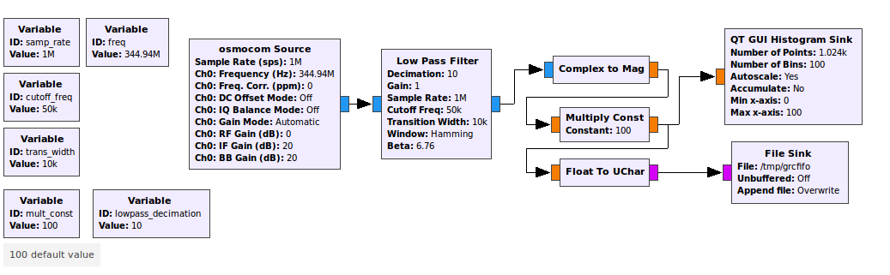
Here's a description of each of the blocks:

- **osmocom Source** - This is the source for data from the RTL-SDR device.  As described above, changing the Gain Mode to Automatic was crucial.
- **Low Pass Filter** - I experimented a bit with the low pass filter settings and found the settings above to work pretty well, but I'm certain they aren't optimal.  But they work well enough, so I moved on.
- **Complex to Mag** - The one thing that proved useful from the demodulation rabbit hole was the direction to use the Complex to Mag block to convert the incoming complex number data into a floating magnitude.  Apparently Complex to Mag^2 is more performant because you save a sqrt call, but I built the code around Complex to Mag and never went back to investigate using Mag^2. Here's a scope screenshot to demonstrate what the signal looks like after Complex to Mag (compare to the complex number signal screenshot further above).
 - 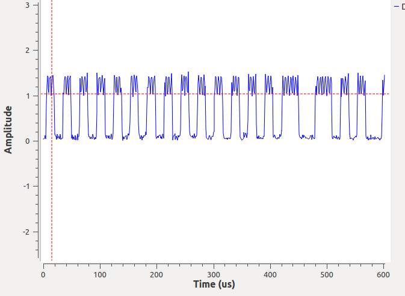
- **Multiply Const** - For ease of processing I eventually convert to bytes, so I need to scale up the incoming floating point data prior to the byte conversion.  I figured that if the amplitude of the complex data is between -1 and 1, the amplitude of the magnitude should be between 0 and 2.  So I multiply by 100 to scale up the value while keeping it comfortably within the range of a byte.
- **Float to UChar** - This converts the scaled floating point data to a byte.
- **File Sink** - The outputs the stream of bytes to a named pipe (which the accompanying python code will then read from).

You may have noticed that I also included a histogram sink.  I wasn't sure what the noise floor would be after I scaled up by 100, so I used the histogram sink in accumulate mode to try to identify the byte values that I would treat as noise vs signal in the python code.  Here's a screenshot of the histogram after a couple signal triggers.
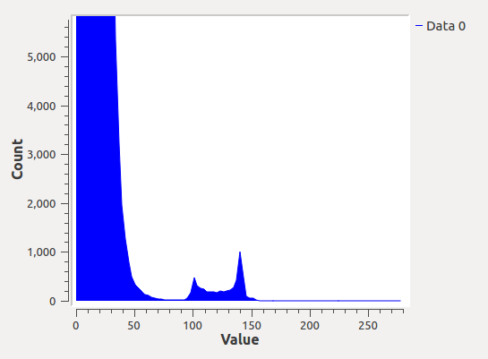
You can see that byte values above 90 or so appear to be signal, and those below 60 appear to be noise.  I later discovered the packets of data include CRCs, so I ended up using a lower noise floor than this so that I could capture weak signals.  The CRC ensures I don't end up treating the noise as signal.

One additional note: I first started with higher sample rate and lower decimation, but playing around with the different permutations a bit, I ended up with 1Mhz sample rate and a decimation of 10 in the low pass filter.  This seemed to be the sweet spot for signal quality against CPU usage.

And finally: I will note again that I was, and still am, an novice with gnuradio and GRC.  I'm certain there are both optimizations to make to the above flowchart, as well as many ways to succeed with the Clock Recovery and other blocks that stymied me.  But, this is what I ended up with and, if nothing else, it is functional.

[Part 2 (Protocol)](part2.md) -\->

VV [Code](https://github.com/denglend/decode345) VV