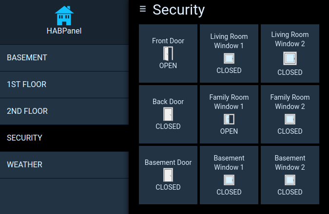

---
---
# MQTT and OpenHAB
My original purpose in reading and parsing the sensor data was to integrate the sensor states into my home automation system.  I use [OpenHAB](http://www.openhab.org/), which supports integrating data from arbitrary sources via the [MQTT Binding](https://github.com/openhab/openhab1-addons/wiki/MQTT-Binding).

### The Sender
I used [paho-mqtt](http://www.eclipse.org/paho/) library, which is available in Python and a number of other languages.
I decided just to send each sensor's open/closed state.  It would require additional overhead (creating "items") on the OpenHAB side to record the low battery state, tamper state, etc.  For me, it wasn't worth it, since if a sensor is in low battery state, it will already appear on the alarm panel and beep annoyingly.  And I'm not concerned about anyone tampering with my sensors.  If I ever remove the alarm panel, I'll transmit the battery status to OpenHAB as well.

The code to do this is as simple as:

```
import paho.mqtt.client as mqtt
client = mqtt.Client()
client.connect(Settings["MQTTHostName"], 1883, 60)
client.publish("/security/"+devicelist[device],"OPEN" if 1<<7 & status >0 else "CLOSED")
client.disconnect()
```

### The receiver
There are already number of tutorials on getting MQTT woqrking with OpenHAB so won't repeat that here.  The item file entries I use are like this:
	
```
Contact security_BasementDoor "Basement Door [%s]" (gSecurity) {mqtt="<[mosquitto:/security/Basement Door:state:default]"}
Contact security_BasementWindow1 "Basement Window 1 [%s]" (gSecurity) {mqtt="<[mosquitto:/security/Basement Window 1:state:default]"}
Contact security_BasementWindow2 "Basement Window 2 [%s]" (gSecurity) {mqtt="<[mosquitto:/security/Basement Window 2:state:default]"}
```

### HABPanel
HABPanel provides a nice UI on top of OpenHAB.  The final product looks like:


To create the sensor tiles, I use the Template Widget with the following template:

```
Front Door
\
{{itemValue('security_FrontDoor')}}
```

And that's it!

<-\- [Part 2 (Protocol)](part2.md)

[Part 4 (What's Next)](part4.md) -\->

VV [Code](https://github.com/denglend/decode345) VV